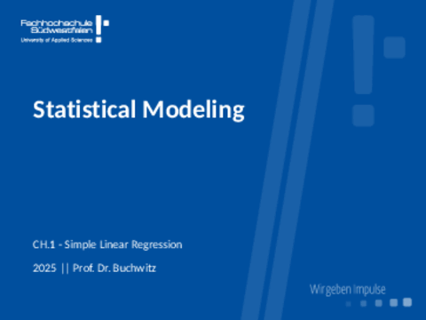

# Simple Linear Regression

> Everything has been said before, but since nobody listens we have to keep going back and beginning all over.
> -- André Gide (Le Traité du Narcisse, 1892)

```{r, echo = F, out.width="80%", fig.cap="[Download Slides](slides/01-SimpleLinearRegression.pdf)"}

```

